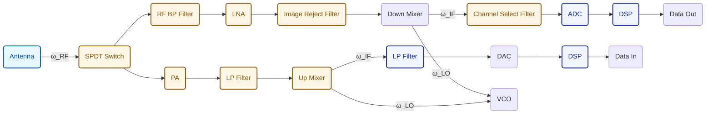

```mermaid
graph LR
    A(Antenna) -->|ω_RF| B(SPDT Switch)
    B --> C(RF BP Filter)
    C --> D(LNA)
    D --> E(Image Reject Filter)
    E --> F(Down Mixer)
    F -->|ω_IF| G(Channel Select Filter)
    G --> H(ADC)
    H --> I(DSP)
    I --> J(Data Out)
    B --> K(PA)
    K --> L(LP Filter)
    L --> M(Up Mixer)
    M -->|ω_IF| N(LP Filter)
    N --> O(DAC)
    O --> P(DSP)
    P --> Q(Data In)
    F -->|ω_LO| R(VCO)
    M -->|ω_LO| R

    %% Class Definitions
    classDef antenna fill:#e6f7ff,stroke:#0050b3,stroke-width:2px,color:#0050b3;
    classDef filter fill:#fff7e6,stroke:#874d00,stroke-width:2px,color:#874d00;
    classDef processor fill:#f0f5ff,stroke:#10239e,stroke-width:2px,color:#10239e;

    %% Applying Classes
    class A,P,I antenna;
    class C,D,E,G,B,K,L,M filter;
    class H,I,P,N processor;
```